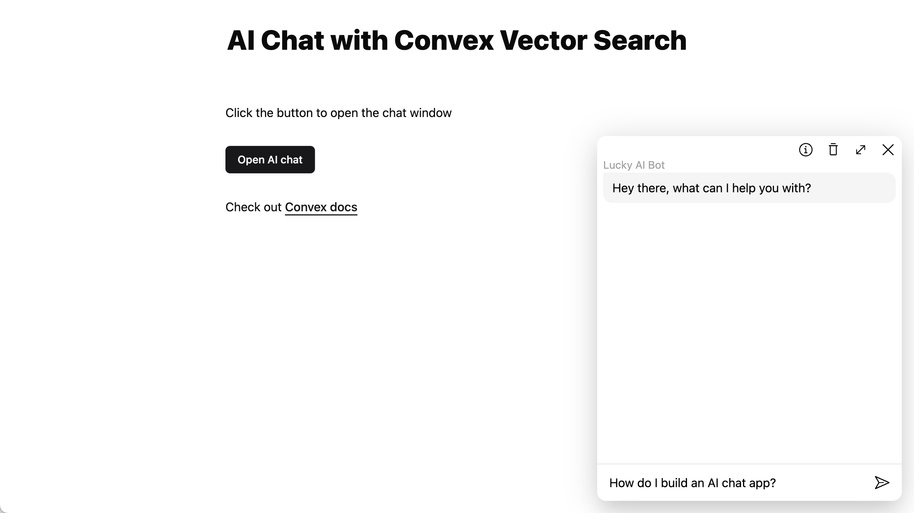

# AI Chat with Convex Vector Search

An example of building AI-powered chat interface using Convex [vector search](https://docs.convex.dev/vector-search).



## Overview:

This app demonstrates how you can add a chat bot to an existing
website, powered by Convex.

- The chat is trigged by a button in [`App.tsx`](./src/App.tsx)
- The chat frontend is all in [`src/aiChat`](./src/aiChat/index.tsx)
- An example of web scraping is in [`convex/ingest/load.ts`](./convex/ingest/load.ts)
- Embedding is performed in [`convex/ingest/embed.ts`](./convex/ingest/embed.ts)
- The public endpoints for the backend are in [`convex/messages.ts`](./convex/messages.ts)
- The answering logic is in [`convex/serve.ts`](./convex/serve.ts)

## Running the App

```
npm install
npm run dev
```

This will configure a Convex project if you don't already have one,
open the Convex dashboard and the web app running on `localhost`.

For the chat itself to work, you must configure the following environment
variable on the Convex dashboard:

- `OPEN_API_KEY` set to an [OpenAI](https://platform.openai.com/) API key (should start with `sk-`)

# What is Convex?

[Convex](https://convex.dev) is a hosted backend platform with a
built-in database that lets you write your
[database schema](https://docs.convex.dev/database/schemas) and
[server functions](https://docs.convex.dev/functions) in
[TypeScript](https://docs.convex.dev/typescript). Server-side database
[queries](https://docs.convex.dev/functions/query-functions) automatically
[cache](https://docs.convex.dev/functions/query-functions#caching--reactivity) and
[subscribe](https://docs.convex.dev/client/react#reactivity) to data, powering a
[realtime `useQuery` hook](https://docs.convex.dev/client/react#fetching-data) in our
[React client](https://docs.convex.dev/client/react). There are also
[Python](https://docs.convex.dev/client/python),
[Rust](https://docs.convex.dev/client/rust),
[ReactNative](https://docs.convex.dev/client/react-native), and
[Node](https://docs.convex.dev/client/javascript) clients, as well as a straightforward
[HTTP API](https://github.com/get-convex/convex-js/blob/main/src/browser/http_client.ts#L40).

The database support
[NoSQL-style documents](https://docs.convex.dev/database/document-storage) with
[relationships](https://docs.convex.dev/database/document-ids) and
[custom indexes](https://docs.convex.dev/database/indexes/)
(including on fields in nested objects).

The
[`query`](https://docs.convex.dev/functions/query-functions) and
[`mutation`](https://docs.convex.dev/functions/mutation-functions) server functions have transactional,
low latency access to the database and leverage our
[`v8` runtime](https://docs.convex.dev/functions/runtimes) with
[determinism guardrails](https://docs.convex.dev/functions/runtimes#using-randomness-and-time-in-queries-and-mutations)
to provide the strongest ACID guarantees on the market:
immediate consistency,
serializable isolation, and
automatic conflict resolution via
[optimistic multi-version concurrency control](https://docs.convex.dev/database/advanced/occ) (OCC / MVCC).

The [`action` server functions](https://docs.convex.dev/functions/actions) have
access to external APIs and enable other side-effects and non-determinism in
either our
[optimized `v8` runtime](https://docs.convex.dev/functions/runtimes) or a more
[flexible `node` runtime](https://docs.convex.dev/functions/runtimes#nodejs-runtime).

Functions can run in the background via
[scheduling](https://docs.convex.dev/scheduling/scheduled-functions) and
[cron jobs](https://docs.convex.dev/scheduling/cron-jobs).

Development is cloud-first, with
[hot reloads for server function](https://docs.convex.dev/cli#run-the-convex-dev-server) editing via the
[CLI](https://docs.convex.dev/cli). There is a
[dashbord UI](https://docs.convex.dev/dashboard) to
[browse and edit data](https://docs.convex.dev/dashboard/deployments/data),
[edit environment variables](https://docs.convex.dev/production/environment-variables),
[view logs](https://docs.convex.dev/dashboard/deployments/logs),
[run server functions](https://docs.convex.dev/dashboard/deployments/functions), and more.

There are built-in features for
[reactive pagination](https://docs.convex.dev/database/pagination),
[file storage](https://docs.convex.dev/file-storage),
[reactive search](https://docs.convex.dev/text-search),
[https endpoints](https://docs.convex.dev/functions/http-actions) (for webhooks),
[streaming import/export](https://docs.convex.dev/database/import-export/), and
[runtime data validation](https://docs.convex.dev/database/schemas#validators) for
[function arguments](https://docs.convex.dev/functions/args-validation) and
[database data](https://docs.convex.dev/database/schemas#schema-validation).

Everything scales automatically, and it’s [free to start](https://www.convex.dev/plans).
